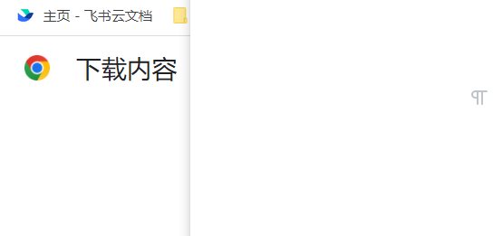

# 第一篇文章

## 前沿

这是我自搭建github.io以来第一篇文章，github.io + mkdocs + MarkText确实是很好的东西。

github.io搭建个人网站可以参考文档：[Github Pages主页](https://pages.github.com/)

mkdocs：[Writing Your Docs - MkDocs](https://www.mkdocs.org/user-guide/writing-your-docs/)

<iframe src="//player.bilibili.com/player.html?aid=303694856&bvid=BV1ZP411E7He&cid=852835864&page=1" scrolling="no" border="0" frameborder="no" framespacing="0" allowfullscreen="true"> </iframe>

