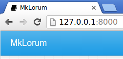

# MkDocs中文文档

使用Markdown来构建项目文档

---

## 概述

MkDocs是一个**快速**、**简单**、**华丽**的静态网站生成器，适用于构建项目文档。文档源文件以Markdown编写，并使用一个YAML文件来进行配置。


### 在任何地方部署

MkDocs生成完全静态的HTML网站，你可以将其部署到GitHub pages、Amzzon S3或你自己选择的其它[任意地方][deploy]。

###很棒的主题

MkDocs有一堆很好看的主题。 官方内置了两个主题：[mkdocs]和[readthedocs]，也可以从[MkDocs wiki]中选择第三方主题，或者[自定义主题][build your own]。 

### 实时预览你的网站

当你写作时，内置的开发服务可以帮助你预览显示效果。当文档有改动时，甚至还可以自动载入并刷新你的浏览器。

###易于定制

通过自定义主题，让你的项目文档以你希望的方式呈现。

---

## 安装

### 使用包管理器安装

如果你拥有并使用包管理器（例如[apt-get]，[dnf]，[homebrew]，[yum]，[chocolatey]等）来在你的系统上安装软件包，那么你可以尝试搜索“MkDocs”软件包，如果有最新版本，则可以使用包管理器来安装（有关详细信息，请查看相应系统的说明文档）。 就这样安装就完成了！ 跳到[入门](＃getting-started)。

如果你的包管理器中没有最新的“MkDocs”软件包，你仍然可以使用软件包管理器来安装“Python”和“pip”。 然后使用pip来[安装MkDocs](#instalming-mkdocs)。

[apt-get]: https://help.ubuntu.com/community/AptGet/Howto
[homebrew]: https://brew.sh/
[dnf]: https://dnf.readthedocs.io/en/latest/index.html
[yum]: http://yum.baseurl.org/
[chocolatey]: https://chocolatey.org/

### 手动安装

为了手动安装MkDocs，你需要在系统上安装[Python]，以及Python包管理器[pip]。你可以使用以下命令来检查是否已经安装了这些软件：

```bash
$ python --version
Python 2.7.14
$ pip --version
pip 18.1 from /usr/local/lib/python2.7/site-packages/pip (python 2.7)
```

MkDocs支持Python2.7.9+、3.4、3.5、3.6、3.7和pypy。

#### 安装Python

可以通过从[python.org]下载适用于你系统的安装程序并运行它来安装[Python]。

!!! Note

    如果你在Windows上安装Python，请确保选中此框以在安装程序提供此选项时将Python添加到PATH（默认情况下通常是关闭）。

    

[python.org]: https://www.python.org/downloads/

#### 安装pip

如果你使用的是最新版本的Python，则默认情况下很可能已经安装了Python包管理器[pip]。但是，你可能需要将pip升级到最新版本：

```bash
pip install --upgrade pip
```

如果你是第一次安装[pip]，下载[get-pip.py]。然后运行以下命令进行安装：

```bash
python get-pip.py
```

#### 安装MkDocs

使用pip安装`mkdocs`包：

```bash
pip install mkdocs
```

你现在应该能运行安装于系统上的`mkdocs`命令了。 运行`mkdocs --version`来检查一切是否正常。

```bash
$ mkdocs --version
mkdocs, version 0.15.3
```

!!! Note
    如果你希望为MkDocs安装联机帮助页，[click-man]工具可以为你生成并安装它们。 只需运行以下两个命令：

        pip install click-man
        click-man --target path/to/man/pages mkdocs

    请参阅[click-man文档]，了解为什么pip不会自动生成和安装联机帮助页。

[click-man]: https://github.com/click-contrib/click-man
[click-man文档]: https://github.com/click-contrib/click-man#automatic-man-page-installation-with-setuptools-and-pip

!!! Note
    如果你使用的是Windows，则上述某些命令可能无法实现开箱即用。

    一个快速的解决方案可能是在每个Python命令前加上`python -m`，如下所示：

        python -m pip install mkdocs
        python -m mkdocs

    对于更永久的解决方案，你可能需要编辑`PATH`环境变量以包含Python安装的`Scripts`目录。 最近的Python版本包含一个为你执行此操作的脚本。 切换到Python安装目录（例如`C:\Python34 \`），打开`Tools`，然后打开`Scripts`文件夹，双击运行`win_add2path.py`文件。 或者，你可以[下载][a2p]脚本并运行它（`python win_add2path.py`）。

[a2p]: https://svn.python.org/projects/python/trunk/Tools/scripts/win_add2path.py

---

## 入门

入门非常简单。

```bash
mkdocs new my-project
cd my-project
```

花一点时间来回顾一下为你创建的初始项目。


有一个名为`mkdocs.yml`的配置文件，以及一个名为`docs`的文件夹，它将包含你的文档源文件。现在`docs`文件夹只包含一个名为`index.md`的文档页面。

MkDocs附带一个内置的开发服务器，可以让你在处理文档时预览文档。 确保与`mkdocs.yml`配置文件位于同一目录中，然后通过运行`mkdocs serve`命令启动服务器：

```bash
$ mkdocs serve
INFO    -  Building documentation...
INFO    -  Cleaning site directory
[I 160402 15:50:43 server:271] Serving on http://127.0.0.1:8000
[I 160402 15:50:43 handlers:58] Start watching changes
[I 160402 15:50:43 handlers:60] Start detecting changes
```

在浏览器中打开`http://127.0.0.1:8000/`，你将看到显示的默认主页：


开发服务器还支持自动重新加载，并且只要配置文件、文档目录或主题目录中的任何内容发生更改，都将重新生成文档。

使用你的文本编辑器打开`docs/index.md`文档，将初始标题更改为“MkLorum”，然后保存更改。浏览器将自动重新加载，你将立即看到更新过的文档。

现在尝试编辑配置文件：`mkdocs.yml`。 将[`site_name`][site_name]设置更改为“MkLorum”并保存文件。

```yaml
site_name: MkLorum
```

你的浏览器应立即重新加载，你将看到新设置的站点名称已经生效。



## 添加页面

现在在文档中添加第二个页面：

```bash
curl 'https://jaspervdj.be/lorem-markdownum/markdown.txt' > docs/about.md
```

由于我们的文档站点将包含一些导航，你可以编辑配置文件，并通过添加[`nav`][nav]设置来管理每个页面导航的顺序、标题和嵌套情况：

```yaml
site_name: MkLorum
nav:
    - Home: index.md
    - About: about.md
```

保存更改，你将看到左侧有“Home”和“About”导航栏，同时右侧还有“Search”，“Previous”和“Next”。


尝试菜单项并在页面之间来回导航。 然后单击`Search`。 将出现一个搜索对话框，允许你搜索任何页面上的任何文本。 请注意，搜索结果包括网站上每次出现的搜索字词，并直接链接到搜索字词所在页面的部分。你无需付出任何努力或配置即可获得所有这些！


## 主题化我们的文档

现在，更改配置文件以通过更改主题来更改文档的显示方式。 编辑`mkdocs.yml`文件并添加[`theme`] [theme]设置：

```yaml
site_name: MkLorum
nav:
    - Home: index.md
    - About: about.md
theme: readthedocs
```

保存更改，你将看到改为使用了ReadTheDocs主题。


## 更改Favicon图标

默认情况下，MkDocs使用[MkDocs favicon]图标。 要使用不同的图标，请在`docs_dir`中创建一个`img`子目录，并将自定义的`favicon.ico`文件复制到该目录。 MkDocs将自动检测并使用该文件作为你的favicon图标。

[MkDocs favicon]: /img/favicon.ico

## 生成网站

那看起来不错。 你已准备好部署`MkLorum`文档。 首先生成文档：

```bash
mkdocs build
```

这将创建一个名为`site`的新目录。 看一下该目录的情况：

```bash
$ ls site
about  fonts  index.html  license  search.html
css    img    js          mkdocs   sitemap.xml
```

请注意，你的源文档已输出为两个名为`index.html`和`about/index.html`的HTML文件。同时各种其他媒体文件也已被复制到`site`目录中作为文档主题的一部分。另外还有一个`sitemap.xml`文件和`mkdocs/search_index.json`。

如果你正在使用版本控制软件，例如`git`，你可能不希望将生成的文件包含到存储库中。只需要在`.gitignore`文件中添加一行`site/`即可。

```bash
echo "site/" >> .gitignore
```

如果你正在使用其他版本控制工具，请你自行查阅相关文档，了解如何忽略特定目录。

一段时间后，文件可能会从文档中删除，但它们仍将驻留在`site`目录中。 要删除那些陈旧的文件，只需在运行`mkdocs`命令时带上`--clean`参数即可。

```bash
mkdocs build --clean
```

##其他命令和选项

还有其他各种命令和选项。有关命令的完整列表，请使用`--help`标志：

```bash
mkdocs --help
```

要查看给定命令上可用的选项列表，请使用带有该命令的`--help`标志。 例如，要获取`build`命令可用的所有选项的列表，请运行以下命令：

```bash
mkdocs build --help
```

## 部署

你刚刚生成的文档站点仅使用静态文件，因此你几乎可以在任何地方托管它。 [GitHub project pages]和[Amazon S3]是个很不错的托管地方，具体取决于你的需求。 将整个`site`目录的内容上传到你托管网站的地方，然后就完成了。 有关常见主机的具体说明，请参阅[部署文档][deploy]页面。

## 获取帮助

要获取关于MkDocs的帮助，请使用[discussion group]、[GitHub issues]或者freenode上的MkDocs IRC频道-`#mkdocs`。

[deploy]: user-guide/deploying-your-docs/
[mkdocs]: user-guide/styling-your-docs/#mkdocs
[readthedocs]: user-guide/styling-your-docs/#readthedocs
[MkDocs wiki]: https://github.com/mkdocs/mkdocs/wiki/MkDocs-Themes
[build your own]: user-guide/custom-themes/
[Amazon S3]: https://docs.aws.amazon.com/AmazonS3/latest/dev/WebsiteHosting.html
[get-pip.py]: https://bootstrap.pypa.io/get-pip.py
[nav]: user-guide/configuration/#nav
[discussion group]: https://groups.google.com/forum/#!forum/mkdocs
[GitHub issues]: https://github.com/mkdocs/mkdocs/issues
[GitHub project pages]: https://help.github.com/articles/creating-project-pages-manually/
[pip]: https://pip.readthedocs.io/en/stable/installing/
[Python]: https://www.python.org/
[site_name]: user-guide/configuration/#site_name
[theme]: user-guide/configuration/#theme
